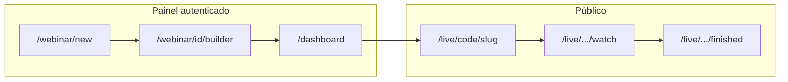

# Análise funcional do webinar (criação à experiência por papel)

Documento de mapeamento do WebinarPro: jornadas, APIs relevantes e permissões por papel. Caminhos abaixo são relativos à pasta [`webinar/`](../).

## Modelo de papéis no código

O sistema usa o enum `Role` em [`prisma/schema.prisma`](../prisma/schema.prisma): `ADMIN`, `GERENTE`, `VENDEDOR`. O “gestor” da interface corresponde a **`GERENTE`**. Vendedores podem ter `managerId` apontando para o gestor.

A regra central de **quais webinars aparecem no painel** está em [`src/lib/webinar-access.ts`](../src/lib/webinar-access.ts):

- **ADMIN**: todos os webinars.
- **GERENTE**: webinars em que é dono (`userId`) **ou** webinars de utilizadores cuja `managerId` é o id do gestor.
- **VENDEDOR**: apenas webinars onde ele é o dono (`userId`).

Quem pode **gerir** um webinar específico (editar, live ops, analytics) usa `userCanManageWebinar` / `assertWebinarManagedByUser`: além do dono e do admin, o **GERENTE** pode gerir webinars de vendedores da sua equipa.

---

## Jornada 1: Da criação à publicação (painel interno)

1. **Criação** — [`src/app/webinar/new/page.tsx`](../src/app/webinar/new/page.tsx) + [`src/components/new-webinar/NewWebinarForm.tsx`](../src/components/new-webinar/NewWebinarForm.tsx): nome, slug, data/hora, abas de **registo** (página de captura), **avançado** (redirect, senha, replay, LGPD), integração com preferências do utilizador e templates em [`src/lib/webinar-templates.ts`](../src/lib/webinar-templates.ts).
2. **API de criação** — `POST /api/webinars` em [`src/app/api/webinars/route.ts`](../src/app/api/webinars/route.ts): **apenas GERENTE ou ADMIN** podem criar; **VENDEDOR** recebe 403.
3. **Builder visual** — [`src/app/webinar/[id]/builder/page.tsx`](../src/app/webinar/[id]/builder/page.tsx) + [`src/components/builder/`](../src/components/builder): vídeo, layout, chat, contagem regressiva, participantes, oferta/popup, escassez, prova social, branding, painel “finished”, etc. Estado auxiliar em [`src/store/useWebinarStore.ts`](../src/store/useWebinarStore.ts).
4. **Persistência** — modelo `Webinar` com `config` JSON, status (`DRAFT`, `SCHEDULED`, `LIVE`, `REPLAY`, `FINISHED`), `code`/`slug` únicos; atualização via [`src/app/api/webinars/[id]/route.ts`](../src/app/api/webinars/[id]/route.ts) (incl. restrição de `customScripts` só para **ADMIN**).

---

## Jornada 2: Participante público (“experiência do utilizador” lead)

Não é um utilizador do painel: acede sem login ao funil do webinar.

| Etapa | Rota / ficheiros | Função |
| ----- | ---------------- | ------ |
| Entrada por slug | [`src/app/[slug]/page.tsx`](../src/app/[slug]/page.tsx) | Redireciona para `/live/{code}/{slug}`. |
| Captura / registo | [`src/app/live/[code]/[slug]/page.tsx`](../src/app/live/[code]/[slug]/page.tsx), `CapturePageClient` | Landing de inscrição; pode haver senha na página; registo de visita (`WebinarVisit`). |
| Lead | `POST /api/leads` [`src/app/api/leads/route.ts`](../src/app/api/leads/route.ts) | Cria lead, e-mail de confirmação, rate limit ([`src/lib/rate-limit.ts`](../src/lib/rate-limit.ts)). |
| Lembrete | [`src/app/api/cron/reminder/route.ts`](../src/app/api/cron/reminder/route.ts) | Lembrete ~1h antes (campo `reminderEmailSentAt` no `Lead`). |
| Assistir | [`src/app/live/[code]/[slug]/watch/`](../src/app/live/[code]/[slug]/watch/), `WatchPageClient` | Player, fases waiting/live/replay ([`src/lib/webinar-timing.ts`](../src/lib/webinar-timing.ts)), chat SSE ([`src/lib/useChatSse.ts`](../src/lib/useChatSse.ts)), oferta, escassez, corações, enquetes, personalização de copy ([`src/lib/public-copy-personalization.ts`](../src/lib/public-copy-personalization.ts)). |
| Pós-evento | `finished` + `FinishedPageClient` | Página configurável após o evento. |
| Verificação de senha captura | [`src/app/api/webinars/verify-capture-password/route.ts`](../src/app/api/webinars/verify-capture-password/route.ts) | Proteção opcional da página de inscrição. |

---

## Papel: VENDEDOR

- **Navegação** — [`src/components/layout/AppSidebar.tsx`](../src/components/layout/AppSidebar.tsx): vê **Início** e **Conta**; **não** vê “Equipa”, “Temas”, “Novo webinar” (itens com `minRole: GERENTE`).
- **Dashboard** — [`src/app/dashboard/ui/DashboardExecutive.tsx`](../src/app/dashboard/ui/DashboardExecutive.tsx): `canCreateWebinar = false`; lista **“Meus webinars”**; sem métricas agregadas por vendedor (`teamSellerMetrics` omitido); coluna de dono só se misturar com outros (cenário raro para vendedor).
- **Criação**: bloqueada na API (403 no `POST /api/webinars`).
- **Equipa** — [`src/app/dashboard/equipe/page.tsx`](../src/app/dashboard/equipe/page.tsx): redirecionado para `/dashboard`.
- **Operação**: pode usar links do painel para webinars **dele** (live ops, analytics, export) desde que seja o `userId` dono do webinar.

---

## Papel: GERENTE (gestor)

- **Criação e templates**: pode criar webinars e aceder a **Novo webinar** e ao builder.
- **Visão agregada**: dashboard mostra **webinars próprios + da equipa**; gráficos/métricas por vendedor quando aplicável ([`src/lib/team-metrics.ts`](../src/lib/team-metrics.ts)).
- **Equipa** — página “Minha equipa”: vê vendedores sob gestão (atribuição global gestor↔vendedor é sobretudo **ADMIN**).
- **Gestão alheia**: pode editar/operar webinars cujo dono é um vendedor com `managerId` = id do gestor (`webinar-access`).
- **Temas** — [`src/app/dashboard/topics/`](../src/app/dashboard/topics): gestão de topics (a sidebar indica que o vendedor depende do gestor para temas).

---

## Papel: ADMIN

- Mesmas capacidades de **GERENTE** na UI (criar webinar, equipa, temas) com âmbito **global**: lista todos os webinars; em **Equipa** vincula vendedores a gestores; `customScripts` (head/body nas páginas capture/live/finished) só via API patch para admin.

---

## Operação ao vivo e pós-evento (quem conduz o webinar)

- **Console do anfitrião** — [`src/app/dashboard/webinars/[id]/live/`](../src/app/dashboard/webinars/[id]/live/) + `LiveOpsClient`: estado do webinar (play/pausa, fase), chat moderado, oferta/escassez, enquetes (`PollAdmin`), macros, atualização de status.
- **Analytics e dados** — [`src/app/dashboard/webinars/[id]/analytics/`](../src/app/dashboard/webinars/[id]/analytics/), APIs de analytics, `export-csv`, leads por webinar.

---

## Autenticação e conta

- Login / forgot / reset password; sessão NextAuth com `role` na sessão ([`src/app/api/auth/[...nextauth]/route.ts`](../src/app/api/auth/[...nextauth]/route.ts)).
- **Conta** — [`src/app/dashboard/settings/`](../src/app/dashboard/settings): preferências (tema, densidade, predefinições para novos webinars, etc., alinhado a [`src/lib/user-preferences-schema.ts`](../src/lib/user-preferences-schema.ts)).

---

## Resumo em uma frase por actor

| Actor | Função principal no produto |
| ----- | --------------------------- |
| **Participante (lead)** | Inscreve-se na URL pública, assiste com chat/ofertas/enquetes, pode ver página final; não usa o painel. |
| **VENDEDOR** | Usa apenas webinars **atribuídos a si** como dono; opera e analisa; **não cria** webinars nem gere equipa/temas globais. |
| **GERENTE** | Cria webinars, configura equipa e temas, vê métricas da equipa, **gerencia webinars dos seus vendedores**. |
| **ADMIN** | Visão e controlo globais, scripts customizados, vinculação gestor↔vendedor na equipa. |

Este documento reflete o estado atual do código em [webinar/](../); mapeamento funcional, sem proposta de alterações de produto.
